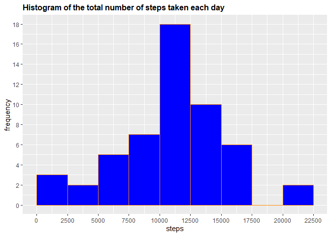
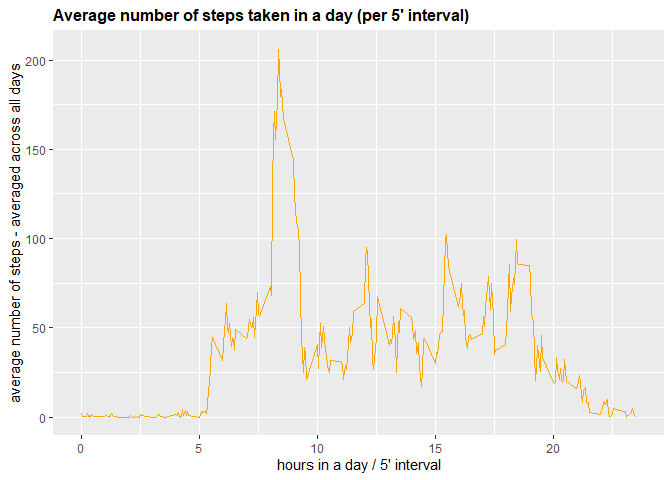
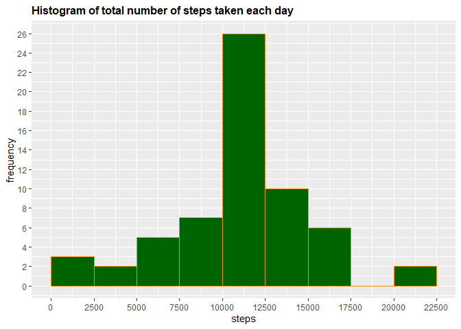
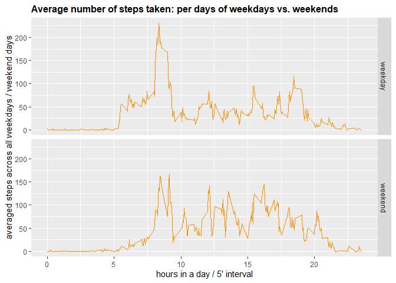

# **Assignment**

## **Q\#1 Loading and preprocessing the data**

Show any code that is needed to:

1.  **Load the data (i.e. read.csv())**

``` r
## ... Setting global option to turn warnings and messages off
knitr::opts_chunk$set(warning=FALSE, message=FALSE)
## ... Load the data
filename <- "activity.zip"
# # ... Checking if archieve (*.zip) or file (*.csv) already exists.
if (!file.exists(filename)){
        fileURL <- "https://d396qusza40orc.cloudfront.net/repdata%2Fdata%2Factivity.zip"
        download.file(fileURL, filename, method="curl")
 }  
if (!file.exists("activity.csv")) { 
        unzip(filename) 
 }
if (!file.exists("figure")) { 
        dir.create("figure") 
 }
activity<-read.csv("activity.csv")
```

1.  **Process/transform the data (if necessary) into a format suitable
    for your analysis**

``` r
library(dplyr)
library(ggplot2)
## ... Exploring the data - process/transform the data if necessary
dim(activity)
```

    ## [1] 17568     3

``` r
names(activity)
```

    ## [1] "steps"    "date"     "interval"

``` r
head(activity)
```

    ##   steps       date interval
    ## 1    NA 2012-10-01        0
    ## 2    NA 2012-10-01        5
    ## 3    NA 2012-10-01       10
    ## 4    NA 2012-10-01       15
    ## 5    NA 2012-10-01       20
    ## 6    NA 2012-10-01       25

``` r
str(activity)
```

    ## 'data.frame':    17568 obs. of  3 variables:
    ##  $ steps   : int  NA NA NA NA NA NA NA NA NA NA ...
    ##  $ date    : chr  "2012-10-01" "2012-10-01" "2012-10-01" "2012-10-01" ...
    ##  $ interval: int  0 5 10 15 20 25 30 35 40 45 ...

``` r
# # ... total & relative number of missing data
c(sum(is.na(activity$steps)),sum(is.na(activity$steps))/dim(activity)[[1]])
```

    ## [1] 2304.0000000    0.1311475

``` r
# # ... transforming the date column from "chr" format into "Date" format using 
activity$date <- as.Date(activity$date)
# # ... transforming the interval column from "int" format into #Factor"("hh:mm") format using
activity$minute <- activity$interval %% 100
activity$hour <- activity$interval %/% 100
activity$elapsed <- activity$hour * 60 + activity$minute
# interval as a factor
activity$sInterval <- as.factor(sprintf("%02d:%02d", activity$hour, activity$minute))
str(activity)
```

    ## 'data.frame':    17568 obs. of  7 variables:
    ##  $ steps    : int  NA NA NA NA NA NA NA NA NA NA ...
    ##  $ date     : Date, format: "2012-10-01" "2012-10-01" ...
    ##  $ interval : int  0 5 10 15 20 25 30 35 40 45 ...
    ##  $ minute   : num  0 5 10 15 20 25 30 35 40 45 ...
    ##  $ hour     : num  0 0 0 0 0 0 0 0 0 0 ...
    ##  $ elapsed  : num  0 5 10 15 20 25 30 35 40 45 ...
    ##  $ sInterval: Factor w/ 288 levels "00:00","00:05",..: 1 2 3 4 5 6 7 8 9 10 ...

``` r
summary(activity)
```

    ##      steps             date               interval          minute     
    ##  Min.   :  0.00   Min.   :2012-10-01   Min.   :   0.0   Min.   : 0.00  
    ##  1st Qu.:  0.00   1st Qu.:2012-10-16   1st Qu.: 588.8   1st Qu.:13.75  
    ##  Median :  0.00   Median :2012-10-31   Median :1177.5   Median :27.50  
    ##  Mean   : 37.38   Mean   :2012-10-31   Mean   :1177.5   Mean   :27.50  
    ##  3rd Qu.: 12.00   3rd Qu.:2012-11-15   3rd Qu.:1766.2   3rd Qu.:41.25  
    ##  Max.   :806.00   Max.   :2012-11-30   Max.   :2355.0   Max.   :55.00  
    ##  NA's   :2304                                                          
    ##       hour          elapsed         sInterval    
    ##  Min.   : 0.00   Min.   :   0.0   00:00  :   61  
    ##  1st Qu.: 5.75   1st Qu.: 358.8   00:05  :   61  
    ##  Median :11.50   Median : 717.5   00:10  :   61  
    ##  Mean   :11.50   Mean   : 717.5   00:15  :   61  
    ##  3rd Qu.:17.25   3rd Qu.:1076.2   00:20  :   61  
    ##  Max.   :23.00   Max.   :1435.0   00:25  :   61  
    ##                                   (Other):17202

## **Q\#2 What is mean total number of steps taken per day?**

For this part of the assignment, you can ignore the missing values in
the dataset.

1.  **Make a histogram of the total number of steps taken each day**

``` r
StepsEachDay <- aggregate(activity$steps, list(activity$date), FUN=sum)
colnames(StepsEachDay) <- c("Date", "Steps")
g <- ggplot(StepsEachDay, aes(Steps))
g+geom_histogram(boundary=0, binwidth=2500, col="darkorange", fill="blue")+ggtitle("Histogram of the total number of steps taken each day")+xlab("steps")+ylab("frequency")+theme(plot.title = element_text(face="bold", size=12))+scale_x_continuous(breaks=seq(0,25000,2500))+scale_y_continuous(breaks=seq(0,18,2))
```



``` r
dev.copy(png, "figure/Figure2_1.png",width=480,height=480,units="px")
```

    ## png 
    ##   3

``` r
dev.off()
```

    ## png 
    ##   2

1.  **Calculate and report the mean and median total number of steps
    taken per day**

``` r
# ... Mean & Median values ...
c(mean(StepsEachDay$Steps, na.rm=TRUE), median(StepsEachDay$Steps, na.rm=TRUE))
```

    ## [1] 10766.19 10765.00

## **Q\#3 What is the average daily activity pattern?**

1.  **Make a time series plot (i.e. type = “l”) of the 5-minute interval
    (x-axis) and the average number of steps taken, averaged across all
    days (y-axis)**

``` r
# create table with steps per days
StepsPerDays <- aggregate(steps~interval,data=activity,FUN=mean,na.action=na.omit)
# variable time (more comprensible for the graph axis)
StepsPerDays$time <- StepsPerDays$interval/100
# draw the line plot
h <- ggplot(StepsPerDays, aes(time, steps))
h+geom_line(col="orange")+ggtitle("Average number of steps taken in a day (per 5' interval)")+xlab("hours in a day / 5' interval")+ylab("average number of steps - averaged across all days")+theme(plot.title = element_text(face="bold", size=12))
```



``` r
dev.copy(png, "figure/Figure3_1.png")
```

    ## png 
    ##   3

``` r
dev.off()
```

    ## png 
    ##   2

1.  **Which 5-minute interval, on average across all the days in the
    dataset, contains the maximum number of steps?**

``` r
# dplyr table 
SPD <- tbl_df(StepsPerDays)
# find the max. value
SPD %>% select(time, steps) %>% filter(steps==max(SPD$steps))
```

    ## # A tibble: 1 x 2
    ##    time steps
    ##   <dbl> <dbl>
    ## 1  8.35  206.

## **Q\#4 Imputing missing values**

Note that there are a number of days/intervals where there are missing
values (coded as NA). The presence of missing days may introduce bias
into some calculations or summaries of the data.

1.  **Calculate and report the total number of missing values in the
    dataset (i.e. the total number of rows with NAs)**

``` r
# dplyr table
AT <- tbl_df(activity)
# find the column
AT %>% filter(is.na(steps)) %>% summarize(missing_values = n())
```

    ## # A tibble: 1 x 1
    ##   missing_values
    ##            <int>
    ## 1           2304

1.  **Devise a strategy for filling in all of the missing values in the
    dataset. The strategy does not need to be sophisticated. For
    example, you could use the mean/median for that day, or the mean for
    that 5-minute interval, etc.**

``` r
# values without NA are imputed in a new column
activity$CompleteSteps <- ifelse(is.na(activity$steps), round(StepsPerDays$steps[match(activity$interval, StepsPerDays$interval)],0), activity$steps)
```

1.  **Create a new dataset that is equal to the original dataset but
    with the missing data filled in.**

``` r
# new dataset - missing data filled in
MDFI <- data.frame(steps=activity$CompleteSteps, interval=activity$interval, date=activity$date)
# see first 12 values of the new dataset
head(MDFI, n=12)
```

    ##    steps interval       date
    ## 1      2        0 2012-10-01
    ## 2      0        5 2012-10-01
    ## 3      0       10 2012-10-01
    ## 4      0       15 2012-10-01
    ## 5      0       20 2012-10-01
    ## 6      2       25 2012-10-01
    ## 7      1       30 2012-10-01
    ## 8      1       35 2012-10-01
    ## 9      0       40 2012-10-01
    ## 10     1       45 2012-10-01
    ## 11     0       50 2012-10-01
    ## 12     0       55 2012-10-01

1.  **Make a histogram of the total number of steps taken each day and
    Calculate and report the mean and median total number of steps taken
    per day. Do these values differ from the estimates from the first
    part of the assignment? What is the impact of imputing missing data
    on the estimates of the total daily number of steps?**

``` r
# data preparation
SPDF <- aggregate(MDFI$steps, list(MDFI$date), FUN=sum)
colnames(SPDF) <- c("Date", "Steps")
# draw the histogram
g <- ggplot(SPDF, aes(Steps))
g+geom_histogram(boundary=0, binwidth=2500, col="darkorange", fill="darkgreen")+ggtitle("Histogram of total number of steps taken each day")+xlab("steps")+ylab("frequency")+theme(plot.title = element_text(face="bold", size=12))+scale_x_continuous(breaks=seq(0,25000,2500))+scale_y_continuous(breaks=seq(0,26,2))
```



``` r
dev.copy(png, "figure/Figure4_1.png")
```

    ## png 
    ##   3

``` r
dev.off()
```

    ## png 
    ##   2

``` r
# ... Mean & Median values with imputed missing data  
c(mean(SPDF$Steps), median(SPDF$Steps))
```

    ## [1] 10765.64 10762.00

``` r
# ... difference between Mean & Median values, without and with impouted missing data 
(c(mean(StepsEachDay$Steps, na.rm=TRUE), median(StepsEachDay$Steps, na.rm=TRUE))-(c(mean(SPDF$Steps), median(SPDF$Steps))))
```

    ## [1] 0.549335 3.000000

The impact of imputing missing data on the estimates of the total daily
number of steps is not significant - bearing in mind that different
imputing / replacement methods may cause different results. In this case
only in the interval from 10.000 to 12.500 steps the frequency has
changed - grown from 18 to 26.

## **Q\#5 Are there differences in activity patterns between weekdays and weekends?**

For this part the weekdays() function may be of some help here. Use the
dataset with the filled-in missing values for this part.

1.  **Create a new factor variable in the dataset with two levels –
    “weekday” and “weekend” indicating whether a given date is a weekday
    or weekend day.**

``` r
MDFI$weekday <- weekdays(MDFI$date)
# create a new variable indicating weekday or weekend
MDFI$DayType <- ifelse(MDFI$weekday=='Saturday' | MDFI$weekday=='Sunday', 'weekend','weekday')
# see first 10 values
head(MDFI, n=10)
```

    ##    steps interval       date weekday DayType
    ## 1      2        0 2012-10-01  Monday weekday
    ## 2      0        5 2012-10-01  Monday weekday
    ## 3      0       10 2012-10-01  Monday weekday
    ## 4      0       15 2012-10-01  Monday weekday
    ## 5      0       20 2012-10-01  Monday weekday
    ## 6      2       25 2012-10-01  Monday weekday
    ## 7      1       30 2012-10-01  Monday weekday
    ## 8      1       35 2012-10-01  Monday weekday
    ## 9      0       40 2012-10-01  Monday weekday
    ## 10     1       45 2012-10-01  Monday weekday

1.  **Make a panel plot containing a time series plot (i.e. type = “l”)
    of the 5-minute interval (x-axis) and the average number of steps
    taken, averaged across all weekday days or weekend days (y-axis).**

``` r
# create table with steps per time across weekdaydays or weekend days
SPD_DT <- aggregate(steps~interval+DayType,data=MDFI,FUN=mean,na.action=na.omit)
# variable time (more comprensible for the graph axis)
SPD_DT$time <- StepsPerDays$interval/100
# draw the line plot
j <- ggplot(SPD_DT, aes(time, steps))
j+geom_line(col="darkorange")+ggtitle("Average number of steps taken: per days of weekdays vs. weekends")+xlab("hours in a day / 5' interval")+ylab("averaged steps across all weekdays / weekend days")+theme(plot.title = element_text(face="bold", size=12))+facet_grid(DayType ~ .)
```



``` r
dev.copy(png, "figure/Figure5_1.png")
```

    ## png 
    ##   3

``` r
dev.off()
```

    ## png 
    ##   2

There appears to be signficantly different activity patterns between
weekdays and weekends - average number of steps in interval is
significantly different but activity intervals, in a day, are simmilar.
